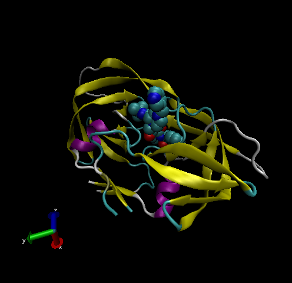

```{r}
db <- read.csv("Data Export Summary.csv", row.names = 1)
head(db)
```

> Q1: What percentage of structures in the PDB are solved by X-Ray and Electron Microscopy.

```{r}
method.sums <- colSums(db)
round((method.sums/method.sums["Total"]) * 100, 2)
```

87.55 percent structures are solved by x-ray and 4.92 percent structure are solved by EM

> Q2: What proportion of structures in the PDB are protein?

```{r}
round(db$Total/method.sums["Total"] * 100, 2)

```

```{r}
total.proportion <- 87.36 + 5.14 + 5.31
total.proportion
```

97.81 of the PBD are protein

> Q3: Type HIV in the PDB website search box on the home page and determine how many HIV-1 protease structures are in the current PDB?

There are 1828 HIV-1 protease structures in the current PDB

## VMD structure visualization image

{width="544"}

> Q4: Water molecules normally have 3 atoms. Why do we see just one atom per water molecule in this structure?

Resolution is not high enough to capture the H atom in water molecules. This is why we do not see all 3 atoms but just the one oxygen atom in the water molecule structure.

> Q5: There is a conserved water molecule in the binding site. Can you identify this water molecule? What residue number does this water molecule have (see note below)?

Yes, the residue number is 308 for the conserved water molecule in the binding site.

> Q6: As you have hopefully observed HIV protease is a homodimer (i.e. it is composed of two identical chains). With the aid of the graphic display and the sequence viewer extension can you identify secondary structure elements that are likely to only form in the dimer rather than the monomer?

Yes, we can identify secondary structure elements that are likely to only form in the dimer rather than the monomer with the aid of the graphic display and the sequence viewer extension.


